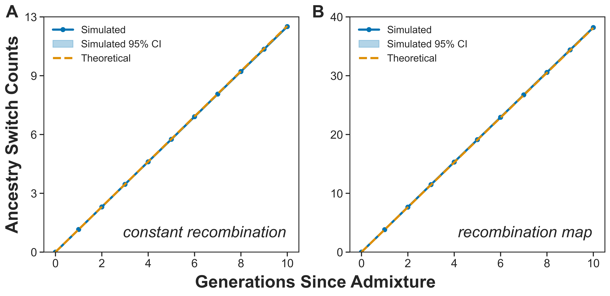

# Modeling ancestry-junction accumulation in admixed genomes

This repository contains the analytical calculations, forward-time simulations, empirical analyses, and figure-generation notebooks for:

> **Nataneli S, Karatas AL, Ferrari T, Patel RA, and Mooney JA.**
> [Analytical expectations for ancestry junction accumulation in admixed genomes](https://doi.org/10.1093/genetics/iyag062).
> *GENETICS* 233(2), iyag062 (2026).

## Overview

Recombination progressively fragments ancestry tracts after admixture, creating ancestry junctions - positions where ancestry changes along a chromosome. This project develops a mathematical framework for predicting the accumulation of these junctions as a function of:

- generations since admixture;
- recombination rate and recombination-map heterogeneity;
- initial ancestry proportions and ancestry heterozygosity; and
- effective population size.

The analytical expectations are evaluated using SLiM forward-time simulations under constant and variable recombination models and compared with ancestry-switch counts from the ASW population in the 1000 Genomes Project.

## Key results

- Analytical expectations closely match forward-time simulation results.
- The framework accommodates both uniform recombination and heterogeneous recombination maps.
- Recombination and ancestry heterozygosity dominate short-term switch accumulation, while effective population size becomes increasingly important over longer timescales.
- Model-based switch counts are consistent with empirical patterns observed in ASW genomes.



## Repository structure

```text
TraceAdmix/
├── parameter_dynamics/   # Effects of model parameters through time
├── simulations/          # SLiM simulations and theory/simulation comparisons
└── empirical/            # Application to ASW ancestry-switch counts
```

### `parameter_dynamics/`

Contains notebooks used to evaluate how ancestry proportion, recombination rate, effective population size, and time since admixture affect expected switch counts.

### `simulations/`

Contains:

- SLiM scripts for constant and variable recombination scenarios;
- notebooks for running simulation replicates;
- Python and shell scripts for extracting ancestry switches from tree sequences;
- notebooks for calculating theoretical expectations; and
- notebooks for comparing simulated and theoretical switch counts.

### `empirical/`

Contains processed ASW switch-count summaries, chromosome lengths, CEU and YRI recombination maps, analytical notebooks, output tables, and the main empirical comparison figure.

## Manuscript outputs

| Output | Notebook |
| --- | --- |
| Figure 1 and Figure S1 | [`parameter_dynamics/main_param_dynamics.ipynb`](TraceAdmix/parameter_dynamics/main_param_dynamics.ipynb) |
| Figure S2 | [`parameter_dynamics/supp_param_dynamics_per_gen.ipynb`](TraceAdmix/parameter_dynamics/supp_param_dynamics_per_gen.ipynb) |
| Simulation schematic | [`simulations/slim_gameplan.ipynb`](TraceAdmix/simulations/slim_gameplan.ipynb) |
| Figure 3 | [`simulations/main_switches_constant_recomb_map.ipynb`](TraceAdmix/simulations/main_switches_constant_recomb_map.ipynb) |
| Figures S3 and S4 | [`simulations/supp_switches_diff_pop_sizes.ipynb`](TraceAdmix/simulations/supp_switches_diff_pop_sizes.ipynb) |
| Figure 4 | [`empirical/main_theoretical_switches_multi_case.ipynb`](TraceAdmix/empirical/main_theoretical_switches_multi_case.ipynb) |
| Table S1 | [`empirical/supp_theoretical_switches_multi_case.ipynb`](TraceAdmix/empirical/supp_theoretical_switches_multi_case.ipynb) |

## Simulation workflow

The simulation analysis proceeds through four stages:

1. **Generate tree sequences** using the constant- or variable-recombination SLiM workflows.
2. **Extract ancestry switches** from each replicate using `sim_switch_analysis_reps.py` and `sim_switch_analysis_reps.sh`.
3. **Summarize simulated counts and calculate theoretical expectations** with the corresponding notebooks.
4. **Compare theory and simulation** using the main and supplemental plotting notebooks.

Important simulation files include:

| Purpose | File |
| --- | --- |
| Run constant-recombination replicates | [`constant_recomb_run_slim_reps.ipynb`](TraceAdmix/simulations/constant_recomb_run_slim_reps.ipynb) |
| Run recombination-map replicates | [`recomb_map_run_slim_reps.ipynb`](TraceAdmix/simulations/recomb_map_run_slim_reps.ipynb) |
| Extract switch counts | [`sim_switch_analysis_reps.py`](TraceAdmix/simulations/sim_switch_analysis_reps.py) |
| Calculate constant-recombination expectations | [`constant_recomb_theory_exp.ipynb`](TraceAdmix/simulations/constant_recomb_theory_exp.ipynb) |
| Calculate recombination-map expectations | [`recomb_map_theory_exp.ipynb`](TraceAdmix/simulations/recomb_map_theory_exp.ipynb) |
| Recombination map used in the published analysis | [`simple_recomb_map_used_in_analysis.txt`](TraceAdmix/simulations/simple_recomb_map_used_in_analysis.txt) |

Generated tree sequences and other large intermediate simulation files are not stored in the repository and must be regenerated with the supplied workflows.

## Requirements

The analysis uses Python 3 and Jupyter with the following packages:

```bash
pip install jupyter numpy pandas matplotlib seaborn demes demesdraw tskit pyslim
```

[SLiM](https://messerlab.org/slim/) is required to regenerate the forward-time simulations.

Clone the repository:

```bash
git clone https://github.com/ShirNat/Quantifying-cumulative-ancestry-switches-in-an-admixed-genome.git
cd Quantifying-cumulative-ancestry-switches-in-an-admixed-genome/TraceAdmix
```

The notebooks use relative paths. Launch each notebook from its containing analysis directory so that input and output paths resolve correctly.

## Data availability

The repository includes the processed ancestry-switch summaries and recombination maps required for the empirical comparison. The underlying high-coverage ASW whole-genome data are available through the [1000 Genomes Project](https://www.internationalgenome.org/data-portal/population/ASW) and are not redistributed here.

Additional information about data processing, quality control, local-ancestry inference, model assumptions, and supplemental analyses is provided in the [published article](https://doi.org/10.1093/genetics/iyag062).

## Citation

If you use this code or framework, please cite:

```text
Nataneli S, Karatas AL, Ferrari T, Patel RA, Mooney JA. 2026.
Analytical expectations for ancestry junction accumulation in admixed genomes.
GENETICS 233(2): iyag062. https://doi.org/10.1093/genetics/iyag062
```

## Authors

- Shirin Nataneli
- Aydin Loid Karatas
- Tessa Ferrari
- Roshni A. Patel
- Jazlyn A. Mooney
